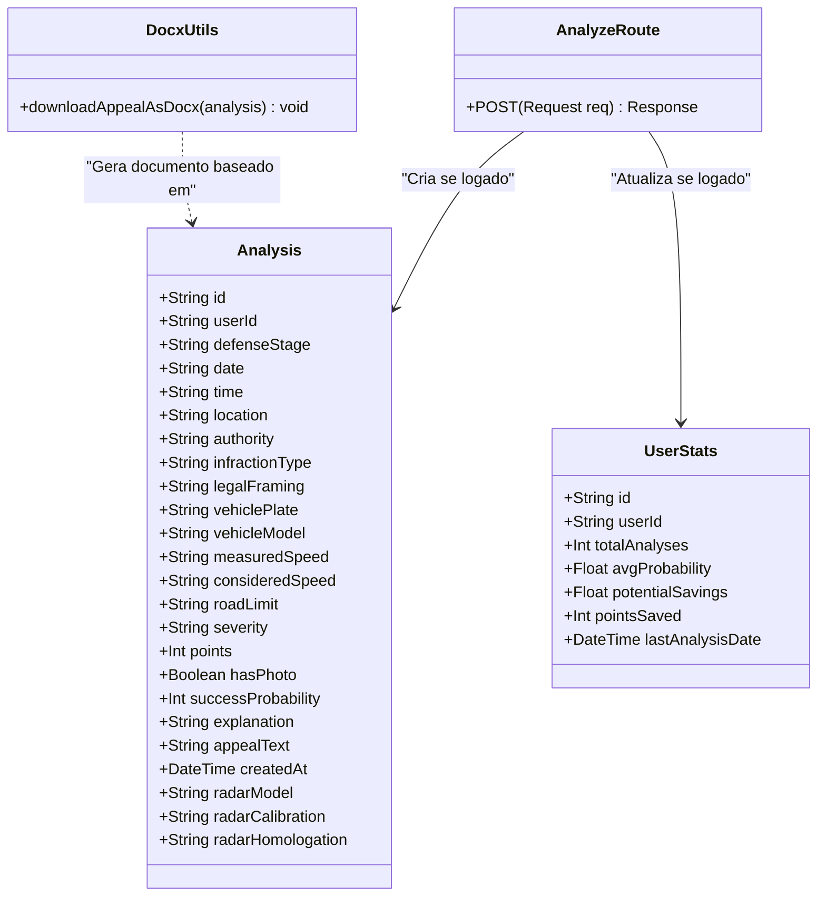

# UNIVERSIDADE FEDERAL DO RIO GRANDE DO NORTE
## DEPARTAMENTO DE ENGENHARIA DE COMUNICAÇÕES
### DISCIPLINA ENGENHARIA DE SOFTWARE

---

# DOCUMENTO DE REQUISITOS - MULTAAI
### Sistema Automático para Geração de Recursos de Multas de Trânsito

**Aluno(a):** [Nome do Aluno]  
**Data:** 25 de Junho de 2026  

---

## 1. INTRODUÇÃO

### 1.1 Motivações
O processo de recorrer de uma multa de trânsito no Brasil é conhecido por ser burocrático, moroso e, muitas vezes, inacessível para a maior parte dos motoristas, que não possuem conhecimentos jurídicos ou recursos financeiros para contratar um advogado especializado. Segundo dados públicos, milhões de multas de trânsito são aplicadas anualmente no Brasil. Grande parte dessas infrações apresenta falhas formais de autuação (erros processuais, prazos extrapolados de notificação, falta de calibração anual do radar pelo INMETRO, etc.), que poderiam levar à anulação da multa se contestadas corretamente. A motivação para a construção do **MultaAI** é democratizar o acesso à defesa administrativa de trânsito através de inteligência artificial.

### 1.2 Funções do Sistema
O MultaAI é um sistema web integrado que automatiza a identificação de inconsistências em autos de infração e elabora petições de recurso. Suas principais funções são:
1. Receber o documento de autuação enviado pelo usuário (imagem ou PDF).
2. Extrair os dados da infração utilizando OCR (Reconhecimento Óptico de Caracteres).
3. Validar se os dados extraídos estão corretos e permitir a edição manual de segurança.
4. Cruzar os fatos com o Código de Trânsito Brasileiro (CTB) e resoluções do CONTRAN.
5. Apontar nulidades processuais de forma automatizada (ex: calibração de radar vencida ou inconsistência de dados).
6. Redigir uma minuta de recurso formal e estruturada.
7. Permitir o download da defesa em formato Word (.docx).
8. Oferecer um Painel de Controle (Dashboard) e Histórico de análises para usuários autenticados.

### 1.3 Alinhamento Estratégico e Objetivos de Negócio
O sistema foi concebido para atuar como uma ferramenta SaaS (Software as a Service) de alta eficiência e baixo custo operacional. 
- **Para o usuário final:** O valor entregue consiste na economia de tempo e dinheiro, eliminando taxas de consultoria advocatícia preliminar e evitando a perda de pontos na CNH.
- **Para a organização:** O software atende ao objetivo estratégico de captar leads qualificados no mercado de motoristas autuados, permitindo o uso gratuito (anônimo) para validação rápida da proposta de valor, enquanto direciona o usuário para cadastros seguros de forma a fidelizá-lo e construir histórico de recorrência.

---

## 2. ATORES

Os atores identificados que interagem com o sistema são:

*   **Motorista Autuado (Usuário Geral / Anônimo):** O condutor que recebeu uma multa e deseja verificar a viabilidade jurídica de um recurso. Pode fazer o envio da multa, visualizar a análise jurídica da IA e baixar a minuta em formato `.docx` de forma anônima.
*   **Motorista Cadastrado (Usuário Autenticado):** O motorista que realizou o login seguro no sistema via Clerk. Possui todos os privilégios do Usuário Anônimo, acrescido do salvamento automático de suas análises, acesso ao histórico de recursos gerados e visualização do Dashboard com estatísticas personalizadas.
*   **Sistema de Inteligência Artificial (Google Gemini):** Atua como ator de suporte no processamento e interpretação semântica dos dados extraídos do auto de infração, executando o cruzamento com as bases do CTB e gerando o texto da defesa.
*   **Serviço de Autenticação (Clerk):** Ator externo que gerencia a segurança de login, registro de usuários e controle de sessões.

---

## 3. PAINEL MVP

A dinâmica de desenvolvimento do MVP (Minimum Viable Product) foi focada em colocar em produção a funcionalidade principal do sistema com o menor atrito possível para o usuário.
- **Escopo do MVP:** O core-business do MultaAI é a detecção automática de erros em multas e a redação da petição para download. 
- **Uso Sem Login:** A fim de diminuir a barreira de entrada e possibilitar uma validação ágil do serviço, foi definido que o login não seria obrigatório para a realização da análise e download inicial.
- **Áreas Restritas:** Apenas recursos adicionais de retenção (Dashboard com estatísticas de pontos salvos, estimativa de economia financeira e histórico retroativo de multas) necessitam de autenticação via Clerk.

---

## 4. ESTÓRIAS DE USUÁRIO

*   **US01 - Ler a Multa por Foto (OCR):** Como motorista autuado, quero tirar uma foto ou subir o PDF da multa para que o sistema leia os dados automaticamente, sem que eu precise digitá-los manualmente.
*   **US02 - Revisar e Corrigir os Dados:** Como motorista autuado, quero revisar e ajustar as informações capturadas pelo OCR em um formulário editável antes de gerar o documento de defesa, garantindo que inconsistências do leitor sejam corrigidas.
*   **US03 - Buscar Erros na Multa (Regras do CTB):** Como motorista autuado, quero que o sistema cruze os dados extraídos com as leis vigentes de trânsito (CTB) e resoluções do CONTRAN para encontrar falhas técnicas ou temporais.
*   **US04 - Gerar o Recurso Pronto:** Como motorista autuado, quero receber uma defesa formal redigida especificamente para o meu caso, de forma rápida e estruturada.
*   **US05 - Ver Prévia e Baixar o Arquivo:** Como motorista autuado, quero visualizar a minuta do recurso na tela e poder baixá-la em formato Word (.docx) para que eu possa imprimir, assinar e protocolar.
*   **US06 - Histórico de Recursos:** Como usuário cadastrado, quero ter acesso a uma área administrativa para consultar minhas análises e recursos gerados anteriormente.
*   **US07 - Entrar e Cadastrar (Clerk):** Como usuário do sistema, quero poder criar uma conta ou fazer login de forma rápida (usando conta Google ou e-mail) para salvar meus dados com segurança.

---

## 5. MATRIZ DE PRIORIZAÇÃO DE REQUISITOS (GUT)

A priorização do escopo do MVP foi estruturada utilizando a Matriz **GUT** (Gravidade, Urgência, Tendência), onde cada critério recebe uma nota de 1 a 5, e a pontuação final é dada pela multiplicação delas ($G \times U \times T$).

| ID | Estória de Usuário | Gravidade (G) | Urgência (U) | Tendência (T) | Score ($G \times U \times T$) | Classificação / Status no MVP |
| :--- | :--- | :---: | :---: | :---: | :---: | :--- |
| **US03** | Buscar Erros na Multa (Regras do CTB) | 5 | 5 | 5 | **125** | Urgente (Core da aplicação - Obrigatório) |
| **US04** | Gerar o Recurso Pronto | 5 | 5 | 5 | **125** | Urgente (Entrega de valor final - Obrigatório) |
| **US02** | Revisar e Corrigir os Dados | 5 | 5 | 4 | **100** | Urgente (Rede de segurança do OCR - Obrigatório) |
| **US01** | Ler a Multa por Foto (OCR) | 4 | 4 | 4 | **64** | Alta (Facilitador do fluxo - Obrigatório) |
| **US05** | Ver Prévia e Baixar o Arquivo | 4 | 4 | 4 | **64** | Alta (Forma física de uso - Obrigatório) |
| **US07** | Entrar e Cadastrar (Clerk) | 3 | 3 | 3 | **27** | Média (Opcional na análise / Obrigatório para Dash) |
| **US06** | Histórico de Recursos | 2 | 2 | 2 | **8** | Baixa (Conveniência - Excluído do fluxo anônimo) |

---

## 6. PROTÓTIPO DE INTERFACES (BAIXA RESOLUÇÃO)

### 6.1 Página Inicial (Fluxo de Entrada)
```
+---------------------------------------------------------------------------------+
|  [Logo] MultaAI                    [Dashboard]  [Analisar]  [Histórico]  [Entrar]  |
+---------------------------------------------------------------------------------+
|                                                                                 |
|                          Gerador de Defesa de Multas                            |
|     Suba a foto ou PDF do auto de infração para criar seu recurso em segundos.   |
|                                                                                 |
|       +-----------------------------------------------------------------+       |
|       | [Atenção: Você está usando o modo de testes. Sem login, os     |       |
|       |  resultados não ficarão salvos no histórico da conta]           |       |
|       +-----------------------------------------------------------------+       |
|                                                                                 |
|       +-----------------------------------------------------------------+       |
|       |                                                                 |       |
|       |                     [ícone upload de arquivo]                   |       |
|       |             Selecione o arquivo da multa (PDF ou Imagem)        |       |
|       |                                                                 |       |
|       +-----------------------------------------------------------------+       |
|                                                                                 |
|                                [ Gerar Recurso ]                                |
|                                                                                 |
+---------------------------------------------------------------------------------+
```

### 6.2 Visualização do Recurso e Resultados
```
+---------------------------------------------------------------------------------+
|  [Logo] MultaAI                    [Dashboard]  [Analisar]  [Histórico]  [Sair]    |
+---------------------------------------------------------------------------------+
|                                                                                 |
|   +------------------------------------+  +---------------------------------+   |
|   | Probabilidade de Sucesso: 85%      |  | Dados da Multa                  |   |
|   | Fase: Defesa Prévia                |  | Placa: ABC-1234                 |   |
|   | IA: Inconsistência no prazo legal. |  | Data: 12/05/2026                |   |
|   +------------------------------------+  +---------------------------------+   |
|                                                                                 |
|   +-------------------------------------------------------------------------+   |
|   | [!] Inconsistências Jurídicas Encontradas                               |   |
|   | - Notificação emitida fora do prazo legal de 30 dias (Art 281 CTB)      |   |
|   +-------------------------------------------------------------------------+   |
|                                                                                 |
|   +-------------------------------------------------------------------------+   |
|   | Minuta do Recurso                                 [ Baixar Word .docx ] |   |
|   | ILUSTRÍSSIMO SENHOR PRESIDENTE...                                       |   |
|   | Pelo presente instrumento, venho requerer o arquivamento...             |   |
|   +-------------------------------------------------------------------------+   |
|                                                                                 |
|   +-------------------------------------------------------------------------+   |
|   | Quer salvar essa petição no histórico?                                  |   |
|   | Crie uma conta e acesse as defesas de qualquer lugar.   [ Criar Conta ] |   |
|   +-------------------------------------------------------------------------+   |
|                                                                                 |
|                  [ Analisar Outra Multa ]     [ Acessar Painel Geral ]          |
|                                                                                 |
+---------------------------------------------------------------------------------+
```

---

## 7. DEFINIÇÃO DE REQUISITOS DE USUÁRIO (CASOS DE USO)

### 7.1 Diagrama de Casos de Uso (Mermaid)

```mermaid
usecaseDiagram
    actor "Motorista Autuado" as motorista
    actor "Motorista Cadastrado" as cadastrado
    actor "Google Gemini API" as gemini
    actor "Clerk Auth" as clerk

    cadastrado --|> motorista

    motorista --> (UC01: Enviar Documento da Multa)
    motorista --> (UC02: Analisar Infração e Gerar Recurso)
    motorista --> (UC03: Visualizar Prévia e Baixar Recurso)
    
    (UC02: Analisar Infração e Gerar Recurso) ..> (UC01: Enviar Documento da Multa) : <<include>>
    (UC02: Analisar Infração e Gerar Recurso) --> gemini

    cadastrado --> (UC04: Visualizar Dashboard e Histórico)
    
    clerk --> (UC05: Efetuar Autenticação)
    (UC04: Visualizar Dashboard e Histórico) ..> (UC05: Efetuar Autenticação) : <<include>>
```

### 7.2 Especificação de Caso de Uso: UC02 - Analisar Infração e Gerar Recurso

*   **Nome do Caso de Uso:** UC02 - Analisar Infração e Gerar Recurso
*   **Atores:** Motorista Autuado (Primário), Google Gemini API (Suporte)
*   **Pré-condições:** O usuário deve ter selecionado ou arrastado um arquivo válido de autuação (PDF ou Imagem de até 10MB) na tela inicial.
*   **Fluxo Principal:**
    1. O usuário clica em "Gerar Recurso Administrativo".
    2. O sistema envia a imagem ou PDF em formato base64 para a API do Google Gemini.
    3. A API do Gemini processa o documento usando capacidades multimodais, extraindo os dados e identificando violações às regras do CTB.
    4. A API do Gemini retorna a análise formatada em formato JSON.
    5. O sistema limpa as marcações de código markdown do texto.
    6. O sistema converte o texto para um objeto JSON estruturado.
    7. **[Subfluxo de Login]** O sistema verifica se o usuário está logado via Clerk.
    8. O sistema renderiza na tela a probabilidade de sucesso, os dados extraídos, a lista de inconsistências e o texto final da minuta.
*   **Subfluxos (Subfluxo de Login):**
    *   *Se o usuário estiver logado:*
        1. O sistema grava a análise no banco de dados vinculando ao `userId` do usuário.
        2. O sistema busca as estatísticas agregadas do usuário (`UserStats`).
        3. O sistema atualiza a contagem de análises, a média de probabilidade e os pontos salvos.
    *   *Se o usuário NÃO estiver logado:*
        1. O sistema pula o salvamento no banco de dados e avança direto para a exibição na tela.
*   **Pós-condições:** A análise estruturada e o texto do recurso são disponibilizados para o usuário visualizar e efetuar o download.

### 7.3 Regras de Negócio (RN)

*   **RN01 - Validação da Emissão da Notificação:** O sistema deve apontar nulidade formal por decadência do direito de punir se a data da emissão da notificação de autuação for superior a 30 dias da data da infração (conforme Art. 281, parágrafo único, II do CTB).
*   **RN02 - Aferição Obrigatória do Radar:** Para infrações registradas por radares eletrônicos, o sistema deve verificar se o laudo de aferição do aparelho emitido pelo INMETRO possui validade inferior a 12 meses. Caso exceda, deve sinalizar inconsistência técnica baseando-se na Resolução 798/2020 do CONTRAN.
*   **RN03 - Anonimato e Persistência:** Nenhuma informação da análise deve ser guardada no banco de dados se a requisição não possuir um token ativo de autenticação do Clerk.
*   **RN04 - Limitação de Arquivos:** O sistema deve rejeitar arquivos maiores que 10MB ou extensões diferentes de `.pdf`, `.jpg`, `.jpeg` e `.png`.

---

## 8. DIAGRAMA DE CLASSES

Estrutura de classes e tabelas mapeadas no modelo de domínio de persistência e serviços (baseado no Prisma Schema e na API):



---

## 9. VALIDAÇÃO DE REQUISITOS

Para fins de auditoria, execução acadêmica e validação dos requisitos propostos:
- **Repositório no GitHub:** [recorredor-de-multa](https://github.com/Leopinheiro132/recorredor-de-multa)
- **Protótipo Executável (Local):** [http://localhost:3000](http://localhost:3000) (Next.js Dev Server)
